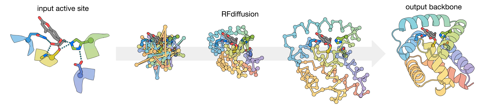

# CA RFdiffusion

This repository contains training and inference code for running CA RFdiffusion: the protein structure diffusion model used for generating backbones in [Computational design of serine hydrolases](https://www.science.org/doi/full/10.1126/science.adu2454), by Anna Lauko, Sam Pellock, et al (*Science, 2025*).

# Table of contents
- [Setup](#getting-set-up)
- [Run inference](#running-inference)
   - [Step 1: diffusion](#step-1-running-the-diffusion-step)
   - [Step 2: refinement](#step-2-running-refinement-on-diffused-outputs)
- [Run training](#running-training)
- [Author contributions to this codebase](#author-contributions) 

## Getting set up 
1. Execute `./make_conda.sh` to create a conda environment. Activate it.
2. To install the [RoseTTAFold-All-Atom](https://github.com/baker-laboratory/RoseTTAFold-All-Atom) (`rf2aa`) and [Frame Flow](https://github.com/microsoft/protein-frame-flow) (`se3_flow_matching`) submodules:
   - run `git submodule init`
   - run `git submodule update --init`
4. Run the tests, via `./rf_diffusion/ca_rfd_tests.sh` while on a cpu (as opposed to running on a host where CUDA_VISIBLE_DEVICES is not empty).
5. If you want to run inference, download the pretrained diffusion and refinement models from
   - `https://files.ipd.uw.edu/pub/ca_rfd/ca_rfd_diffusion.pt`
   - `https://files.ipd.uw.edu/pub/ca_rfd/ca_rfd_refinement.pt`
7. If you want to run training, download
   - The training dataset metadata: `https://files.ipd.uw.edu/pub/ca_rfd/dataset_diffusion_20230214.pkl`
   - The rf2aa structure prediction weights that training began from: `https://files.ipd.uw.edu/pub/ca_rfd/rf2a_25c_414_t1d_81_t2d_69.pt`
   - The raw training set structures: `(working on it--will have a link for you very soon)`

## Running inference 
CA RFdiffusion uses a 2-step process to generate backbones:
1. A diffusion model generates a backbone "trace", where only the CA (alpha carbon) positions are meaningful
2. A "refinement" model takes in the generated CA trace and produces a full, "refined" backbone in which the N-CA-C (and O) atoms should be meaningful.

Please carefully read the details for these steps below.

### Step 1: Running the diffusion step
An example of how to execute the diffusion step can be found in `rf_diffusion/ca_rfd_diffuse.sh`. In there, you'll see the command line execution references a `--config-name`, which in this case is `="RFdiffusion_CA_inference"`. 
This name references the file located at `rf_diffusion/config/inference/RFdiffusion_CA_inference.yaml`, which contains all the flags specifically needed for running inference. You can override any of these flags from the command line, as is demonstrated in `ca_rfd_diffuse.sh`. 

**There are a few flags you should know how to use:**
1. `inference.output_prefix` -- a path that ends with the beginning of a filename, whatever you want your outputs prepended with.
2. `inference.ckpt_path` -- the path to wherever your copy of `ca_rfd_diffusion.pt` (see download link above) landed.
3. `inference.input_pdb` -- the path to a `.pdb` file containing proteins and optionally a non-protein ligand. 
4. `inference.ij_visible` -- the most important inference flag for CA RFdiffusion. `ij_visible` specifies which motif chunks within the contigs string are going to be constrained with respect to each other rigidly. The syntax for writing `ij_visible` is to group together motif chunks you want constrained rigidly together, and separate groups with dashes. In the `RFdiffusion_CA_inference.yaml` file, we have `ij_visible:'abcde' # e is the ligand`, in which all motif chunks including the ligand are constrained with respect to each other, which is why there's only one group and no dashes. If you wanted the first two motif chunks constrained w.r.t each other, and then the next two + the ligand constrained rigidly together, your flag would be `ij_visible:'ab-cde'`. If you want each chunk free to move w.r.t to all the other chunks, you could do ij_visible: 'a-b-c-d-e'.
5. `inference.ligand` -- simply the name of the ligand in the .pdb file (if applicable).
6. `inference.recenter_xt` -- keep this set to true
7. `inference.num_designs` -- how many outputs would you like?
8. `contigmap.contigs` -- See [RFdiffusion](https://github.com/RosettaCommons/RFdiffusion) for a good description of the contigs string. You dont need to include ligand info in this. But just note that from left to right in your contigs string, the contig chunks (i.e., the scaffolded bits of protein) correspond to `a`, `b`, `c`, etc. in your `ij_visible`. So in the contigs string `'30,A1-4,40,A5-5,40,A6-6,40,A7-7,40'`, the `A1-4` chunk corresponds to `a` in `ij_visible` because it is the leftmost chunk, and `A5-5` corresponds to `b` in `ij_visible`, because it is the second contig chunk in the string. The pattern continues from here.
9. `motif_only_2d` -- you must keep this set to `true`, as it is the indicator telling the code to send in the motif information via the template (pairwise) input of RoseTTAFold.
10. `diffuser.r3.noise_scale` -- Linna An found that 0.05 was most effective for efficiency of generating designs that pass filters. However, if you like, you may explore higher `noise_scale` to trade diversity for efficiency of passing design filters.

### Step 2: Running refinement on diffused outputs
One you've run diffusion, you should see some .pdb files and .trb files in your specified output directory. If you visualize the .pdb files at this step, they might look a bit distressed because the only meaningful atomic positions in there are the CA coordinates, while the N/C positions are still scrambled--but you can get a rough idea of what the protein fold will be. The next step is to use the refinement model to turn that "CA trace" into a full backbone. 

You can use `rf_diffusion/ca_rfd_refine.sh` to do this! It runs the same `run_inference.py`, just in "refinement mode", and all you have to do is point the script at your .pdb file you'd like to refine and input the name of the ligand (if applicable) that appears in your designs. 

**Important Note** 

This step automatically goes and finds the *original* .pdb file that your motif elements came from (by looking inside the .trb file paired with your .pdb file), and *re-templates* this perfect motif structure into the refinement forward pass, as a second opportunity to correct any motif imperfections generated by the diffusion step. This means that if you move your original motif .pdb file from its location when you ran the diffusion step, the code wont find the file, and it will complain. Also, this means that you need to keep your .trb files and not rename them, so the code can automatically find them. 

Once done, you should see some nice refined backbones in the same folder as your original CA, with the `_refined` tag in the filename. At this point, the refined files are ready for sequence design. Godspeed.

## Running training
To run the CA RFdiffusion training procedure for the diffusion model or the refinement model, you can: 
1. Execute `.rf_diffusion/ca_rfd_train.sh`. Within this script, you can comment/uncomment lines to train
   * the diffusion model
   * the refinement model

Note that to train the model out of the box, you need to have downloaded the pretrained structure prediction weights, training dataset metadata `.pkl` file, and the source RCSB crystal structure files (we are working on packing this up for users to download).

## Author contributions
This codebase was written in a collaborative effort by multiple people. As such, we ellaborate on specific major contributions by DJ and WA. 

David Juergens conceived, implemented and deployed the key training and inference components for "CA RFdiffusion" diffusion and refinement models described in [1]. This includes the funcionalities for: 
- Supplying protein and small molecule motif elements to RFdiffusion via the pairwise disto/anglogram input
- Randomly constraining discontiguous motif elements with respect to each other via the template inputs
- The 1D and 2D motif mask sampling, and featurization of the masks as inputs
- The diffusion model loss function formulation, which includes coordinate-based errors and all-atom-FAPE (sourcing code from [2] and [3])
- Performing diffusion over CA coordinates only (sourcing code from [4]) by setting all N-CA-C frame orientations to the identity rotation
- Refinement of CA-only traces with a separately trained refinement model
- The refinement model input featurization, training schema, and loss formulation
- Building out idealized motif sidechains from scaffolded backbone components
- Centering the noisy Xt coordinate inputs to the origin at each step
- Altering the transform stack (see below) to include templated motif features
  
Woody Ahern developed the broader, base training setup ("training harness") contained in this codebase, which supports the modular experimentation and training of various all-atom diffusion models generally. This includes functionalities for: 
- Data loading, with fallbacks
- The data loading transform stack, which is a modular and customizeable data stream shared by inference and training to (a) transform raw molecular features into their model inputs, and (b) ensure consistency between training and inference.
- Deterministic training (useful for comparrisons and debugging)
- Logging and exception handling

## Acknowledgements
DJ and WA would also like to thank (in no particular order) for contributions to this codebase: Brian Coventry, Rohith Krishna, Will Sheffler, Paul Kim, Magnus Bauer, Doug Tischer, Andrew Favor, Helen Eisenach, Anna Lauko, Sam Pellock, Long Tran, and Linna An. 

Citations:
1. Lauko, et al., "Computational design of serine hydrolases" (*Science, 2025*)
2. Krishna, et al., "Generalized biomolecular modeling and design with RoseTTAFold All-Atom" (*Science, 2024*)
3. Anishchenko, et al., "Modeling protein-small molecule conformational ensembles with ChemNet" (*bioRxiv, 2024*)
4. Watson, et al., "De novo design of protein structure and function with RFdiffusion" (*Nature, 2023*)
